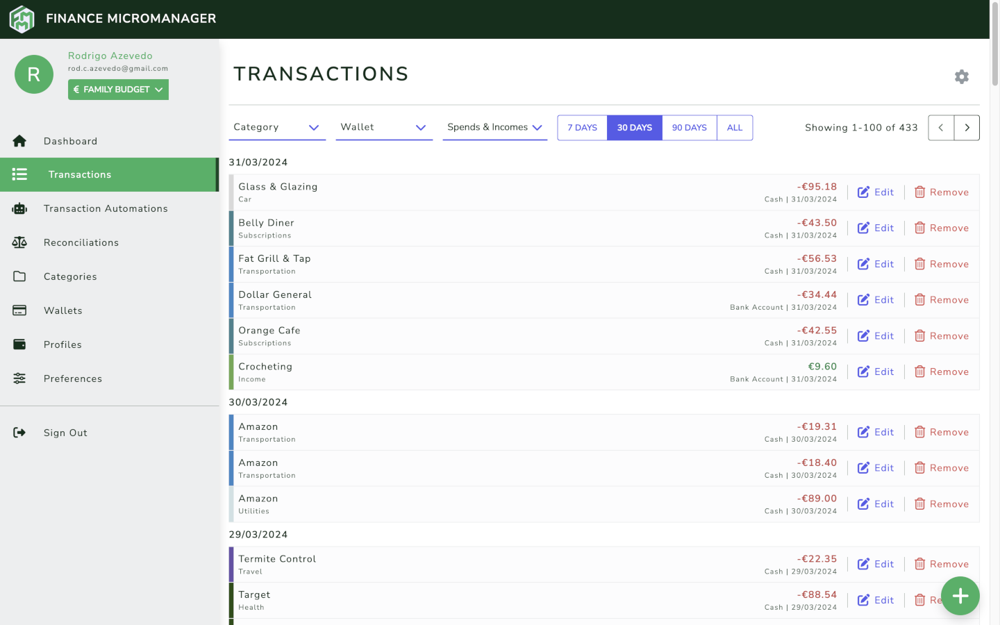
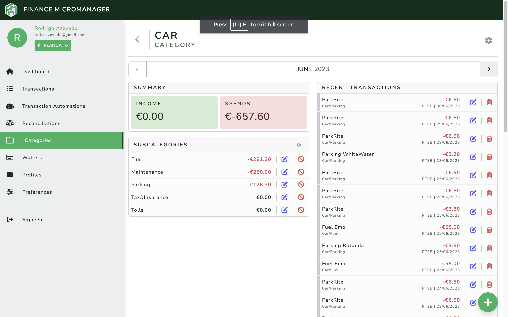

[![Build Status][build-status-shield]][build-status-url]
[![Latest Release][release-shield]][release-url]
[![MIT License][license-shield]][license-url]

  

  <h1 align="center">Finance MicroManager</h1>

  

    Finance MicroManager is a personal finance management tool designed to allow users in meticulously tracking
    day-to-day expenses. With a user-friendly interface, this web-based application ensures you have complete control
    and visibility into your financial life. Input and monitor your expenditures with great detail, allowing you to
    make informed decisions about your budget, savings, and financial goals. Finance MicroManager provides the tools
    you need to navigate and manage your finances effectively. Start taking control of your financial future today!
  

## About The Project

### Features

#### Transaction tracking

  

Tracking your expenses is simple and effective. With the ability to categorize transactions and assign them to specific
wallets, you can have precise control over your expenses. Categories allow you to separate and analyse spending habits
and pinpoint areas for improvement, while wallets help you track money across different accounts or purposes.

#### Categories and Subcategories

  

Our category system is designed for flexibility and precision. You can categorise your expenses into broad categories
like "Food" or "Transportation" and further break them down into subcategories like "Groceries" or "Dining Out". This
granular approach allows you to optionally capture detailed insights into your spending habits, helping you understand
where your money goes with clarity and accuracy. In the example above, a category "Car" is broken down into many
subcategories, allowing you to know whether you're spending more money with fuel, parking, or that fancy new car wax.

#### Profiles and Wallets

*TODO*

#### Reconciliations

*TODO*

#### Transaction Automations

*TODO*

#### Transaction Predictions

*TODO*

#### Other noteworthy features

- Support for English and Brazilian Portuguese languages
- Mobile-first responsive layout
- PWA support

## Self-hosting

You can self-host Finance MicroManager! The project includes a Dockerfile and configuration files tailored to
be hosted in a Kubernetes cluster, but you can also configure your own deployment and host the project anywhere.

*Further details on this coming soon*

### Built With

* [![Kubernetes][kubernetes-shield]][kubernetes-url]
* [![Ruby on Rails][rails-shield]][rails-url]
* [![Vue][Vue.js]][Vue-url]
* [![Bootstrap][Bootstrap.com]][Bootstrap-url]
* [![Font Awesome][fontawesome-shield]][fontawesome-url]

### Prerequisites

* PostgreSQL
* Redis

### Installation

*TODO*

#### Credentials

To configure credentials, copy the contents of `config/credentials/credentials.yml.example` into the corresponding
environment's credentials file, and change the values accordingly.

## Roadmap

**This list is non-exhaustive, and does not follow any particular order.**

- [x] Allow for more complex transaction automation schedules
- [x] Transaction Predictions (form automations to speed up the creation of transactions)
- [ ] Batch importing of transactions
- [ ] Better insights and statistics in category and wallet page
- [ ] Authorization management
- [ ] Admin area
- [ ] Splitting transactions into multiple sub-transactions of different categories
- [ ] New Transaction types (transfer between wallets, credit card transactions, etc)
- [ ] Suggest default categories when creating a new profile
- [ ] Category/Subcategory translation support
- [ ] Budgeting support
- [ ] 50/30/20 (needs/wants/savings) rule tracking and insights
- [ ] Support more period types other than just month (week, fortnight, quarter, year)
- [ ] Omniauth authentication
- [ ] Multi factor authentication
- [ ] Notification centre
- [ ] Dark Mode
- [ ] Profile photo support
- [ ] Stream changes to frontend with ActiveCable

The issue and feature tracking is still not in a public platform, but it will eventually be moved to GitHub Issues.

## Contributing

Contributions are what make the open source community such an amazing place to learn, inspire, and create.
Any contributions you make are **greatly appreciated**.

If you want to report a bug, or if you have a suggestion that would make this better, please fork the repo and create
a pull request. You can also simply open an issue describing the suggestion or bug.
Don't forget to give the project a star! Thanks again!

1. Fork the Project
2. Create your Feature Branch (`git checkout -b my-amazing-feature`)
3. Commit your Changes (`git commit -m 'Implement some AmazingFeature'`)
4. Push to the Branch (`git push origin my-amazing-feature`)
5. Open a Pull Request

## License

Distributed under the MIT License. See `LICENSE.txt` for more information.

[release-shield]: https://img.shields.io/github/v/release/roooodcastro/finance-micromanager?style=flat-square
[release-url]: https://github.com/roooodcastro/finance-micromanager/releases
[build-status-shield]: https://img.shields.io/github/actions/workflow/status/roooodcastro/finance-micromanager/rubyonrails.yml?style=flat-square
[build-status-url]: https://github.com/roooodcastro/finance-micromanager/actions
[license-shield]: https://img.shields.io/github/license/roooodcastro/finance-micromanager.svg?style=flat-square
[license-url]: https://github.com/roooodcastro/finance-micromanager/blob/master/LICENSE.txt
[rails-shield]: https://img.shields.io/badge/Ruby%20on%20Rails%207.1-D30100?style=flat-square&logo=rubyonrails&logoColor=FFFFFF
[rails-url]: https://rubyonrails.org/
[Vue.js]: https://img.shields.io/badge/Vue.js%203-35495E?style=flat-square&logo=vuedotjs&logoColor=4FC08D
[Vue-url]: https://vuejs.org/
[Bootstrap.com]: https://img.shields.io/badge/Bootstrap%205.3-563D7C?style=flat-square&logo=bootstrap&logoColor=white
[Bootstrap-url]: https://getbootstrap.com
[kubernetes-shield]: https://img.shields.io/badge/Kubernetes-326CE5?style=flat-square&logo=kubernetes&logoColor=white
[kubernetes-url]: https://kubernetes.io/
[fontawesome-shield]: https://img.shields.io/badge/Font%20Awesome-528DD7?style=flat-square&logo=fontawesome&logoColor=white
[fontawesome-url]: https://kubernetes.io/
